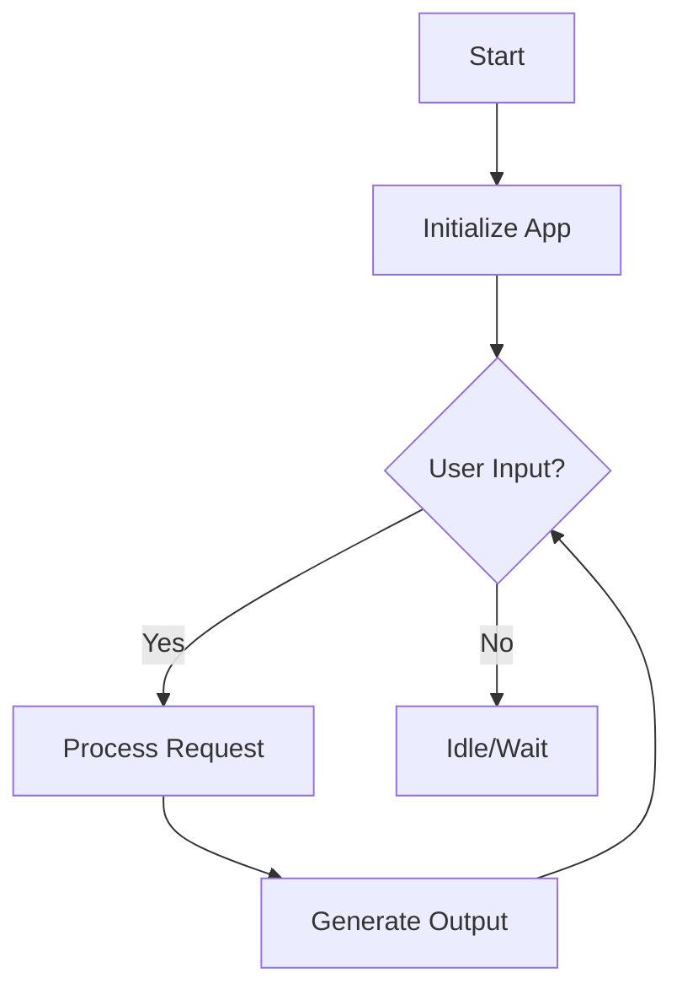

# 📘 Project Title

> Short tagline or one-sentence description of the project.  
> Example: *“An AI-powered chatbot that turns questions into clear answers.”*

---

## 📖 Overview
- What does this project do?  
- Why is it useful?  
- Who is it for?  

---

## 🚀 Features
- ✅ Feature 1 (clear, short explanation)  
- ✅ Feature 2  
- ✅ Feature 3  

---

## 🛠️ Installation

### Prerequisites
- [ ] Requirement 1 (e.g., Python 3.9, Node.js, Docker)  
- [ ] Requirement 2  

### Steps
```bash
# clone the repo
git clone https://github.com/username/repo-name.git

# go into the folder
cd repo-name

# install dependencies
npm install
```

---

## 🎮 Usage
```bash
# run the app
npm start
```

Example:
- Open browser → `http://localhost:3000`  
- Default login: `admin / password`  

---

## 📊 Project Flow (Mermaid Diagram)


---

## 📂 Project Structure
```
repo-name/
├── src/              # source code
├── docs/             # documentation files
├── tests/            # test cases
└── README.md         # this file
```

---

## ⚡ Examples
- Example 1:  
- Example 2:  

(Add screenshots, gifs, or code snippets here.)

---

## 📦 Deployment
- How to deploy on **Docker** / **Heroku** / **AWS ECS**  
- Add environment variables if needed  

---

## 🤝 Contributing
1. Fork the project  
2. Create your feature branch: `git checkout -b feature/YourFeature`  
3. Commit changes: `git commit -m 'Add new feature'`  
4. Push to branch: `git push origin feature/YourFeature`  
5. Open a Pull Request  

---

## 🐛 Issues / Support
- Report bugs via [GitHub Issues](link-to-issues)  
- Contact: your.email@example.com  

---

## 📜 License
Distributed under the MIT License. See `LICENSE` for details.  

---

## ✒️ Author
**Muhammad Naveed Ishaque (Eks2)**  
_Content Creator | Technical Writer | AI Collaborator_  

> “Bridging Complexity & Clarity — because good code deserves great documentation.”  
